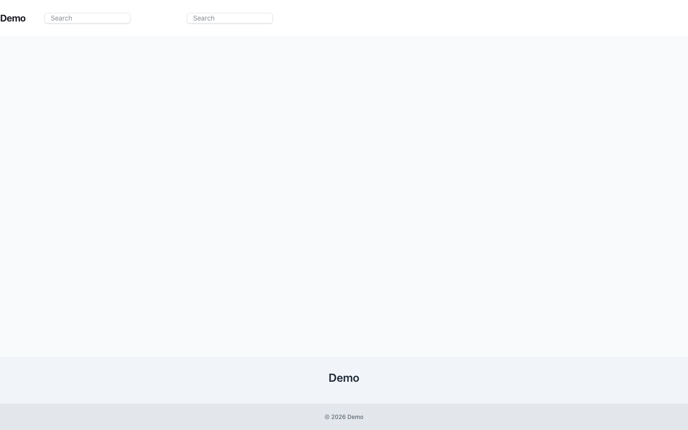

# Extending Asset & Result Rendering with Render Hooks

Render hooks are not the normal CSS or JavaScript loading mechanism. Use the typed [Frontend resource graph](frontend-resources.md) for ordering, deduplication, lazy activation, CSP diagnostics, and output safety.



The Render Hook system lets you inject custom content into asset and result components at specific locations—without overwriting Blade files. This is the recommended, future-proof way for any package to extend Capell Frontend UI.

---

## How It Works

- **Register extensions** for named locations using the `RenderHookLocation` enum (e.g. `BeforeTitle`, `AfterTitle`, `Footer`, `BeforeResult`, `AfterResult`, `AssetTags`, etc).
- Each extension receives a `RenderHookContext` DTO (with `location`, `item`, and extensible data) and returns HTML/Blade output.
- Extensions can be:
    - Closures
    - Classes implementing `RenderHookExtensionInterface`
    - Blade view/component names (as strings)
- All registered extensions for a location are rendered at the corresponding hook in the UI, sorted by priority (lower numbers first).
- **Granular control:** You can scope a hook registration to a specific scenario (e.g. only for assets, or only for a specific Blade file/component) using the `scenario` and `target` parameters.

---

## Registering an Extension

In your package's service provider:

```php
use Capell\Frontend\Data\RenderHookContext;
use Capell\Frontend\Enums\RenderHookLocation;
use Capell\Frontend\Support\Render\RenderHookRegistry;

// Register for all assets
app(RenderHookRegistry::class)->register(
    RenderHookLocation::AfterTitle,
    function (RenderHookContext $context) {
        return view('your-package::partials.asset-badge', ['context' => $context])->render();
    },
    10, // priority
    'asset' // scenario
);

// Register for a specific file/component
app(RenderHookRegistry::class)->register(
    RenderHookLocation::AfterTitle,
    'your-package::components.asset-badge',
    10, // priority
    'asset', // scenario
    'asset/tile.blade.php' // target
);
```

When rendering, the scenario and target are passed automatically by the Blade component:

```blade
{!!
    app(RenderHookRegistry::class)->renderAll(
        RenderHookLocation::AssetTags,
        [
            'tags' => $tags,
            'item' => $item ?? null,
        ],
        'asset',
        'asset/tile.blade.php',
    )
!!}
```

---

## Where Hooks Render

Hooks are available in:

- `x-capell::asset.tile` (`BeforeContent`, `BeforeTitle`, `AfterTitle`, `Footer`)
- `x-capell::asset.index` (`BeforeTitle`, `AfterTitle`, `Footer`)
- `x-capell::page.results` (`BeforeResult`, `AfterResult`)
- `x-capell::app` (`BodyEnd`) and layout/header/footer components (`MainContent`, `HeaderAfter`, `FooterBefore`, `FooterAfter`)

---

## Example: Adding a Badge

1. **Create a Blade partial or component in your package:**

```blade
{{-- resources/views/components/asset-badge.blade.php --}}
@if ($context->item['is_featured'] ?? false)
    <span class="badge badge-featured">Featured</span>
@endif
```

2. **Register the extension for the desired location and scenario** (see above).

---

## Extension Priority

- Lower priority numbers render first.
- Multiple packages can register for the same location—output is composable.

---

## Context DTO

- The `RenderHookContext` DTO provides the hook location and the current item.
- Extend this DTO if you need to pass more data in the future.

---

## Contract

- Implement `RenderHookExtensionInterface` for reusable, testable extensions.

---

## Testing

- See `tests/Frontend/Unit/RenderHookExtensionRegistryTest.php` for real-world examples, including scenario/target-specific hooks.

---

## Best Practices & Notes

- Extensions are rendered in the order of their priority for each location.
- You have full access to the current context object.
- This mechanism is additive and composable—multiple packages can contribute extensions at any hook.
- Prefer this system over Blade overrides for maintainability and upgrade safety.
- Use scenario/target scoping for granular control when needed.
