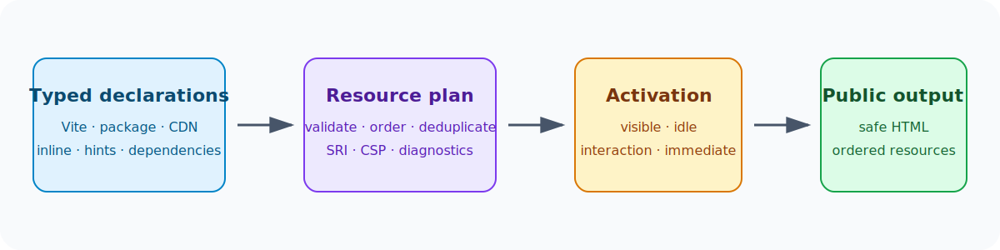

# Frontend Resources

Capell uses one typed resource graph for application Vite entries, package-published files, trusted CDN resources, inline trusted code, loading strategies, hints, dependency ordering, diagnostics, and optimization. Use this graph for CSS and JavaScript; render hooks are for public markup.



## Application Vite entries and dependencies

Register npm requirements with `FrontendPackageDependencyRegistry`:

```php
$registry->register(new FrontendPackageDependencyData(
    name: 'swiper',
    versionConstraint: '^12.0',
    type: FrontendPackageDependencyType::Runtime,
    package: 'acme/gallery',
));
```

Contribute the application entry with `new ViteResourceSourceData('resources/js/gallery.js')`. Run `php artisan capell:frontend-after-install` to print the deterministic dependency, Vite-input, publication, and build plan. Non-interactive execution mutates only with `--apply`.

Applications must include the generated entries:

```js
import { capellViteInputs } from './vendor/capell-app/frontend/resources/js/capell-vite-inputs.js'

laravel({
    input: [
        'resources/css/app.css',
        'resources/js/app.js',
        ...capellViteInputs(),
    ],
})
```

Doctor reports missing integration when generated entries exist.

## Published package resources and conditional widgets

Published files remain outside Vite. Register a typed group for LayoutBuilder selection:

```php
$resources->register(new FrontendResourceGroupData(
    key: 'acme.gallery',
    label: 'Gallery',
    package: 'acme/gallery',
    resources: [
        FrontendResourceData::style(
            handle: 'acme/gallery:style',
            package: 'acme/gallery',
            source: new PublicResourceSourceData('/vendor/acme-gallery/gallery.css'),
            loadingStrategy: PresentationLoadingStrategy::Visible,
        ),
        FrontendResourceData::classicScript(
            handle: 'acme/gallery:runtime',
            package: 'acme/gallery',
            source: new PublicResourceSourceData('/vendor/acme-gallery/gallery.js'),
            loadingStrategy: PresentationLoadingStrategy::Visible,
        ),
    ],
));
```

LayoutBuilder is the selection-to-activation bridge. Visible, idle, and interaction targets remain independent; shared canonical resources load on the first valid trigger and are deduplicated.

## Trusted CDN resources

The simple CDN case is concise:

```php
FrontendResourceData::classicScript(
    handle: 'acme/maps:leaflet',
    package: 'acme/maps',
    source: new ExternalResourceSourceData('https://cdn.example.com/leaflet@1.9.4.js'),
);
```

Add security metadata when available:

```php
new ExternalResourceSourceData(
    httpsUrl: 'https://cdn.example.com/library@2.1.0.js',
    integrity: 'sha384-BASE64_DIGEST',
    crossOrigin: CrossOrigin::Anonymous,
    referrerPolicy: ReferrerPolicy::NoReferrer,
);
```

External URLs must be absolute HTTPS without credentials or fragments; query strings are preserved. `capell-frontend.external_resources.integrity_policy` is `warn` by default and `require` rejects missing SRI.

Declare dependent libraries by stable handle:

```php
$plugin = FrontendResourceData::classicScript(
    handle: 'acme/charts:labels',
    package: 'acme/charts',
    source: new ExternalResourceSourceData('https://cdn.example.com/labels@2.js'),
    dependsOn: ['acme/charts:library'],
);
```

Async scripts cannot declare or satisfy ordered dependencies.

## Hints, CSP, and trust

Trusted PHP may use `inlineStyle()` and `inlineScript()`; the renderer applies Laravel Vite's nonce. Use typed `FrontendResourceHintData` for preload, module-preload, preconnect, and DNS-prefetch. Capell does not automatically preconnect to external origins.

Plans report required `script-src`, `style-src`, `connect-src`, and `font-src` origins but do not change CSP headers. The application owns CSP authorization and nonce propagation.

Editor-controlled theme data may select trusted registered groups or local public paths. It cannot introduce remote URLs or inline executable code.

## Diagnostics and tests

Doctor and page-resource diagnostics report source validity, missing dependencies, cycles, aliases, package ownership, activation reasons, placement, SRI, CSP origins, local raw/gzip sizes, and remote resources as unmeasurable. Public requests never fetch third-party assets for measurement.

Tests should prove presence and absence, dependency order, placement, canonical deduplication, lazy activation, and that anonymous HTML/events contain only URLs, attributes, and opaque resource tokens—not Composer packages, internal handles, model IDs, selectors, field paths, permissions, or signed URLs.

## Breaking upgrade

Mix, loose `css()`/`js()` builders, `FrontendAssetRequirementData`, `FrontendAssetManifestData`, `FrontendAssetContributor`, `FrontendAssetManifestRenderer`, `VendorAssetData::buildAsset()`, and `VendorAssetData::npmDependency()` were removed. Use typed source/factory declarations, `FrontendResourceContributor`, `FrontendResourcePlanRenderer`, and `FrontendPackageDependencyRegistry`.
