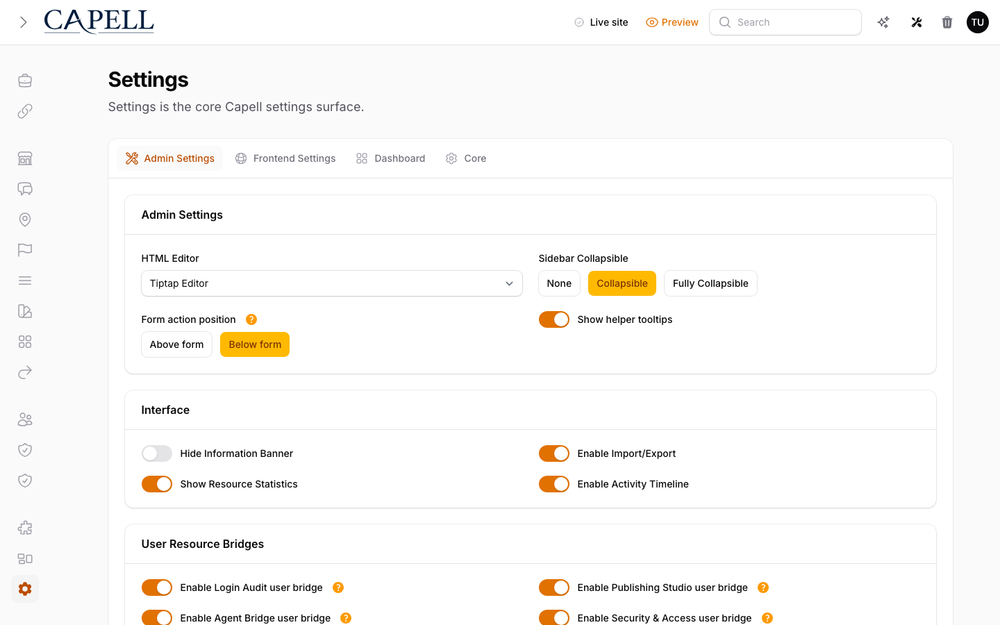

# Server Configuration



This document covers production server expectations for Capell Frontend, static artifact generation, and local cache settings.

---

## Overview

Capell Frontend serves public page requests through Laravel. The package can also generate static HTML artifacts with metadata for deployment pipelines, CDNs, or static export tooling:

```sh
php artisan capell:generate-html
```

By default, generated artifacts are written under `storage/framework/capell-static-artifacts`. Set `CAPELL_FRONTEND_STATIC_ARTIFACTS_PATH` when a deployment needs those artifacts written to a different writable directory.

This package no longer assumes a public page-cache directory. Do not configure Apache or Nginx to serve one unless another installed package explicitly owns and documents that directory.

---

## Web Server

Configure the web server with the normal Laravel public root and fallback behavior:

```nginx
server {
    listen 80;
    server_name example.com;
    root /var/www/html/public;

    index index.php;

    location / {
        try_files $uri $uri/ /index.php?$query_string;
    }

    location ~ \.php$ {
        fastcgi_pass unix:/run/php/php8.4-fpm.sock;
        fastcgi_param SCRIPT_FILENAME $realpath_root$fastcgi_script_name;
        include fastcgi_params;
    }

    location ~ /\.(?!well-known).* {
        deny all;
    }
}
```

Enable text compression for public HTML and text assets in the same server or proxy layer. Lighthouse's `uses-text-compression` audit expects compressed responses for HTML, CSS, JavaScript, SVG, JSON, and XML:

```nginx
gzip on;
gzip_vary on;
gzip_min_length 1024;
gzip_types
    text/plain
    text/css
    text/xml
    application/javascript
    application/json
    application/xml
    application/rss+xml
    image/svg+xml;
```

If Brotli is available in the production proxy, enable it for the same MIME types. Do not audit through an uncompressed local PHP server when comparing Lighthouse scores for Capell frontend pages.

---

## Static Artifacts

Generate artifacts for all published page URLs:

```sh
php artisan capell:generate-html
```

Generate artifacts for one site or selected URLs:

```sh
php artisan capell:generate-html --site=1
php artisan capell:generate-html --url=/ --url=/about
```

The generated manifest is written to:

```text
storage/framework/capell-static-artifacts/manifest.json
```

Each manifest entry includes the output file path, response headers, dependency fingerprints, runtime fingerprints, asset fingerprints, and generation time. Deployment tooling should read the manifest instead of guessing paths from URLs.

Capell refuses to write a static artifact when the rendered response contains explicit authoring markers, field paths, model IDs, or signed admin editor URLs. Those responses are sent with `Cache-Control: private, no-store` and `X-Frontend-Cache: BYPASS`. Treat this as a deployment blocker: fix the Blade, theme, or package output rather than trying to force artifact generation.

---

## Cache Management

After bulk content changes or a database restore, clear Laravel's runtime caches and regenerate static artifacts:

```sh
php artisan optimize:clear
php artisan capell:generate-html
```

Capell automatically invalidates model-aware render data and listing caches when content changes are published. The following changes trigger targeted invalidation:

- Publishing a page invalidates that page's render data.
- Updating a page's slug invalidates the page, descendants, and listing pages.
- Updating site settings, translations, themes, or media invalidates cached render data that used those records.
- Site setting changes also match URLs by configured domains, so root pages such as the homepage are covered.
- Changes to global navigation invalidate pages that render navigation.

---

## Development Environment

To skip frontend cache reads and writes in development, add to your `.env`:

```env
DEBUG_SKIP_CACHE=true
CAPELL_HTML_CACHE=false
CAPELL_WRITE_HTML_CACHE=false
CAPELL_PUBLIC_RENDER_DATA_CACHE=false
CAPELL_MINIFY_HTML=false
```

`DEBUG_SKIP_CACHE=true` bypasses cache reads and writes on every request without disabling the cache system globally. This is the simplest option for local debugging.

---

## Performance Optimisations

- Enable HTTP/2 or HTTP/3 on the production server or proxy.
- Enable gzip or Brotli for HTML, CSS, JavaScript, SVG, JSON, and XML.
- Set long-lived cache headers for versioned CSS, JavaScript, images, and fonts.
- Use a CDN in front of Laravel or in front of the generated static artifacts.
- Use OPcache for PHP to speed up the dynamic fallback path.
- Consider a reverse-proxy cache only when it respects Capell's public safety and authenticated-rendering headers.

---

## Further Reading

- [Page & Site Loading](page-site-loading.md) - how the frontend request pipeline works
- [Testing Frontend](testing-frontend.md) - public rendering and cache-safety checks
- [Presentation Delivery](presentation-delivery.md) - renderer and layout behavior
- [Artisan Commands](../../../docs/development/artisan-commands.md) - command reference
